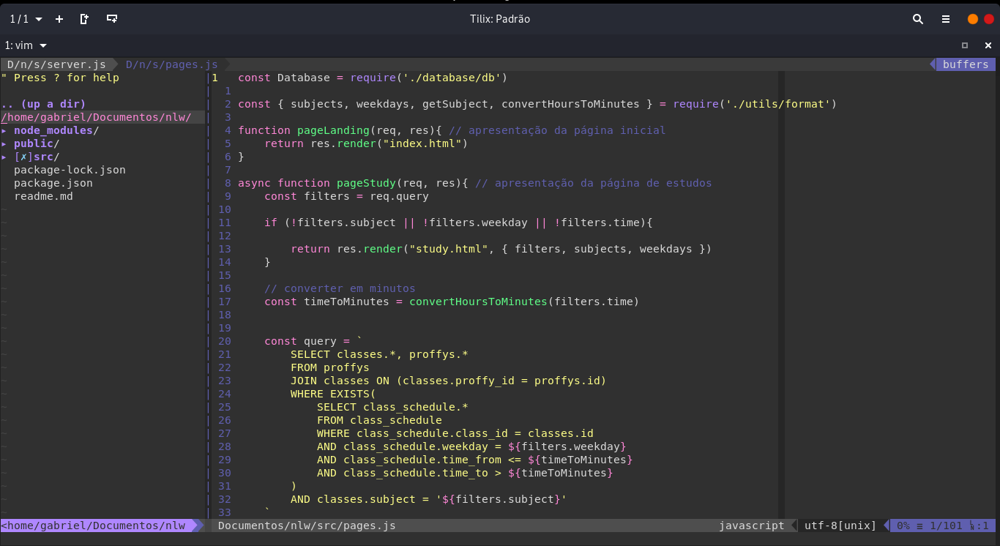

## Vim Personalizado

### Requisitos: [Vundle](https://github.com/VundleVim/Vundle.vim)

### Tema utilizado: [dracula](https://draculatheme.com/vim)

### Instalação:

clone o repositório no diretório /home:

```git
git clone https://github.com/gabrieldk/.vim.git ~
```
copie o arquivo .vim para o seu /home

```shellscript
cp ~/.vim/.vimrc ~
```

abra o `vim`, digite no terminal

no modo normal digite:

```vimscript
:PlugInstall
```
saia do vim `:wq`

no terminal digit
```shellscript
apt install build-essential cmake python3-dev
```
```shellscript
cd ~/.vim/plugged/YouCompleteMe
python3 install.py --all
```

### Resultado:





### Atalhos presonalizados


| Atalhos | Descrição |
 -------- | ---------
 F10 | seleciona tudo (usar no modo normal)
 leader + c | copia o que estiver selecionado no modo visual para a area de transferencia 
 leader + v | cola da area de transferencia (usar no modo normal) 
 leader + n | abre a lista de diretórios (usar no modo normal) 

**NOTA:** A tecla leader personalizada ficou sendo o espaço
